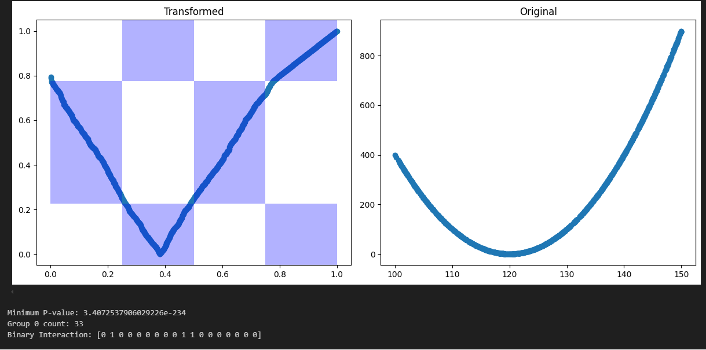
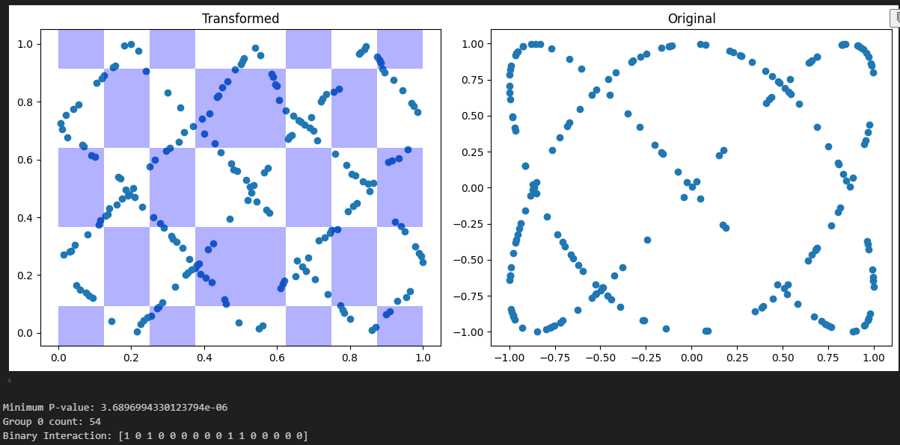
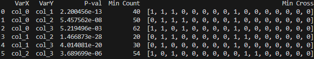

#  Binary expansion testing (BET) - an efficient algorithm for dependency testing

The Python package computes the BET statistics, the associated p-value, and the Binary Interaction Design (BID). A comprehensive explanation of the BET statistics calculation is provided in the referenced paper. Additionally, the package efficiently computes the BET statistics and related metrics for all possible pairs of variables in a dataframe in parallel. It also includes plotting functions for visualizing both the data and the results.

Developed by Darren Liu under the supervision of Prof. [Kai Zhang](https://zhangk.web.unc.edu/)

[Reference paper: Zhang, K. (2019). BET on Independence, Journal of the American Statistical Association, 114, 1620-1637](https://zhangk.web.unc.edu/wp-content/uploads/sites/14612/2019/04/2019-BET-on-Independence.pdf)


## Interfaces


## Usage examples:
### 1 Test one pair of variables
#### 1.1
```
from BETpy.bet import DDMbet
ddmbet = DDMbet()
min_p, mincount, min_cross = ddmbet.runBET(dataX, dataY, plot=True, find_min = False, max_depth=8, p_value_threshold=0.05)
```
Example:
```
dataX = np.random.uniform(100, 150, size=1000)
dataY = (dataX-120)*(dataX-120)
min_p, mincount, min_cross= ddmbet.runBET(dataX, dataY, plot=True)
```
<p align="center">
  
</p>

#### 1.2
```
np.random.seed(0)
dataX = np.random.uniform(0, 20*math.pi, size=200)
xvar = [math.sin(0.3*2*x) for x in dataX]
yvar = [math.sin(0.3*3*x) for x in dataX]
min_p, mincount, min_cross= ddmbet.runBET(xvar, yvar, max_depth=10, plot=True)
```
<p align="center">
  
</p>

### 2 Test all pairs of columns in a dataframe
#### 2.1
```
ddmbet = DDMbet()
mydf=pd.DataFrame()
np.random.seed(0)
dataX = np.random.uniform(0, 20*math.pi, size=200)
mydf[f"col_0"] =dataX
for i in range(1,4):
    dataY =[math.sin(0.3*i*x) for x in dataX]
    mydf[f"col_{i}"] =dataY

results_df = ddmbet.test_variable_pairs(mydf, max_depth=8, nprocess=-1)
```
<p align="center">
  
</p>

## Dependencies and Installation
Developed in Python 3.11.9. Other versions of python should work too.
```
pip install -r requirements.txt
```
## TODO
- [] Support the use of GPU
